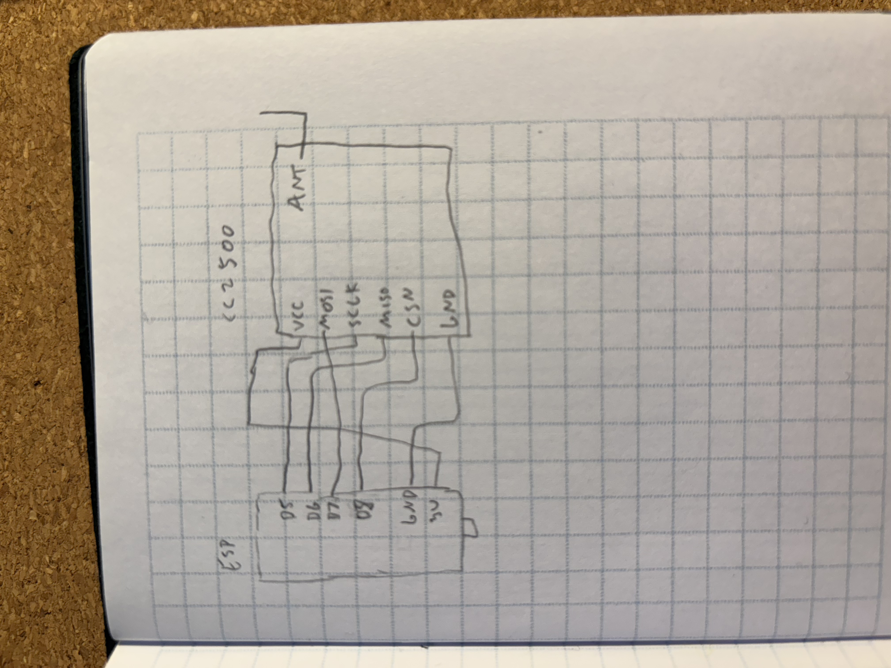
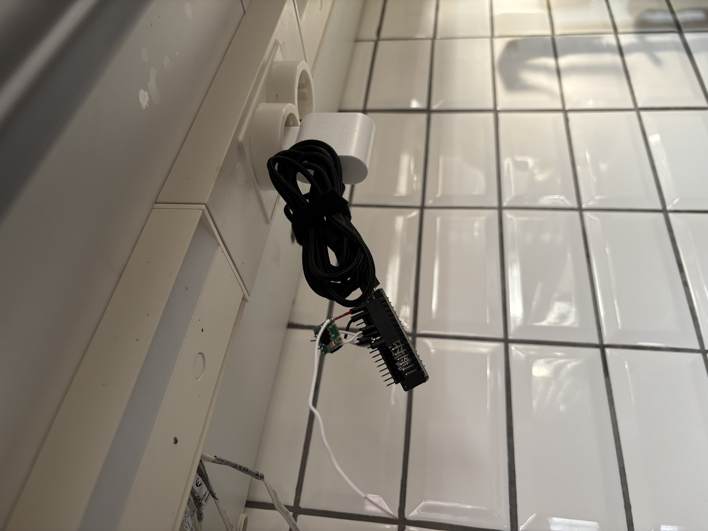

# Ansluta Remove
A custom remote to [IKEA ANSLUTA](https://www.amazon.co.uk/ANSLUTA-Remote-Control-OMLOPP-UTRUSTA/dp/B01CM4KB78) remote kitchen lighting. The product has long been deprecated, since modern installations use [Trådfri](https://www.ikea.com/se/sv/p/tradfri-driver-foer-tradloes-styrning-smart-gra-60342656/) lightning for the same purpose. Project is heavily based on [this repo](https://github.com/matlen67/ansluta-control/tree/master), but modified for my setup.

## Instructions
- Solder project according to [circuit diagram](./img/circuit.jpeg). Add female pin headers between wires and esp to allow reprogramming, which needs to be done at least once.
- For the ANT, just use a longer wire with no end as antenna. Remove the isolation at the end.

- Edit `./src/config_wifi.h` with your wifi details
- Push project to your esp, preferrably in debug config.
- Navigate to web interface, e.g. [https://192.168.176.175/ansluta/getAddress](https://192.168.176.175/ansluta/getAddress)
- Press button on your original remote within 5 seconds.
- Your address should appear in the web interface and logs.
- Edit `./src/config_ansluta.h` and fill in your address bytes. 
- Push project again, this time in prod mode.
- Access web remote at [https://192.168.176.175/ansluta](https://192.168.176.175/ansluta)

## API
curl http://192.168.176.175/ansluta/0
curl http://192.168.176.175/ansluta/50
curl http://192.168.176.175/ansluta/100

## Automation
I use Trådfri for the rest of my lights, but luckily, Apple Homekit kan be used as glue:

- Open home app.
- Add new automation, pick another light in your kitchen that you want to sync the Ansluta lights to.
- Select `when lights turn on`.
- Scroll to the bottom of the action list and select `convert to shortcut`.
- Remove the default action and instead add `Get content from URL`.
- Paste an url from above for 100% `/ansluta/100`.
- Setup another shortcut for when the light turns off.
- Lights should now be synced.

## Parts

| Part    | Link |
| -------- | ------- |
| ESP8266 or similar ESP32 board | https://www.electrokit.com/en/nodemcu-v3     |
| CC2500 Transiver module (WLC24D) | https://www.ebay.com/itm/296500813267 |
| Female pin headers (optional: to allow detaching esp for reprogramming) | https://www.electrokit.com/en/hylslist-2.54mm-1x20p |

## Wiring

## Misc
git update-index --assume-unchanged src/config_wifi.h
git update-index --no-assume-unchanged src/config_wifi.h