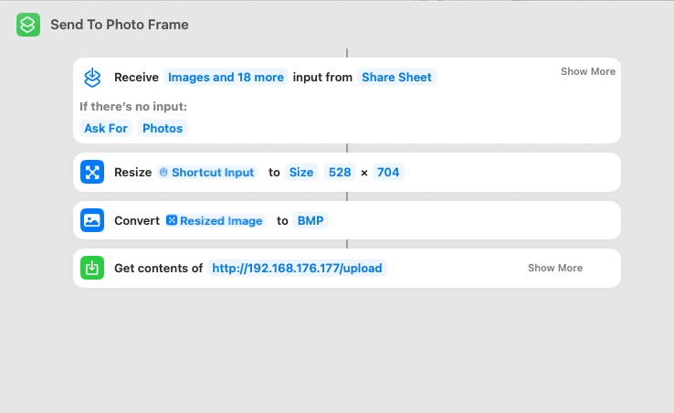

# Photo frame
E-ink display that shows a random picture from apple photos.


## Uploading images
Images need to be processed before uploading. My display has a resolution of 528x880, for which resized images from an iphone 15 have the wrong aspect ratio. My solution to this was to offset/center the rendered image in code, search for `int16_t yOffset` in `gfx.h` to modify. Next, when it comes to actually uploading the image, you have 2 choices:

### Option 1: Curl
`curl -v -F "data=@/path/to/file.bmp" http://ip.to.server/upload`

### Option 2: Using apple shortcuts. 
Having an active shortcut that sends the currently viewed picture works fine, but the problem starts if you want to schedule this since the timeout is aggressively small. My workaround for this is to send a compressed image to a raspberry pi running an api wrapper around imagemagick. This server then converts the image to BMP and sends it to the photo frame, free of any timeouts.

1) Install dependencies on rpi
```
sudo apt-get update
sudo apt-get install nodejs
```

2) Build app in `/api` folder. `
```
yarn
yarn build
```

3) Copy `dist/main.js` to rpi.
4) Run using `node main.js`. You need to provide env variable `photoFrameIp`, default is my ip.





## Parts
| Part    | Link |
| -------- | ------- |
| Controller for e-ink displays | https://www.electrokit.com/kontrollerkort-for-e-pappersdisplay-esp32 |
| E-ink display | https://www.aliexpress.com/item/1005004369892606.html |
| Frame | https://www.ikea.com/se/sv/p/roedalm-ram-valnoetsmoenstrad-30548871/#content |


## References
- https://www.waveshare.com/wiki/E-Paper_ESP32_Driver_Board
- https://github.com/jeff-makes/parkpal/tree/main
- https://github.com/javl/image2cpp
- https://github.com/ayushsharma82/ElegantOTA/blob/master/examples/AsyncDemo/AsyncDemo.ino
- https://github.com/Rudranil-Sarkar/Floyd-Steinberg-dithering-algo/tree/master
- https://learn.adafruit.com/preparing-graphics-for-e-ink-displays/command-line
- https://github.com/ESP32Async/ESPAsyncWebServer/blob/main/examples/Upload/Upload.ino
- https://github.com/Rudranil-Sarkar/Floyd-Steinberg-dithering-algo/blob/master/bitmap.cpp