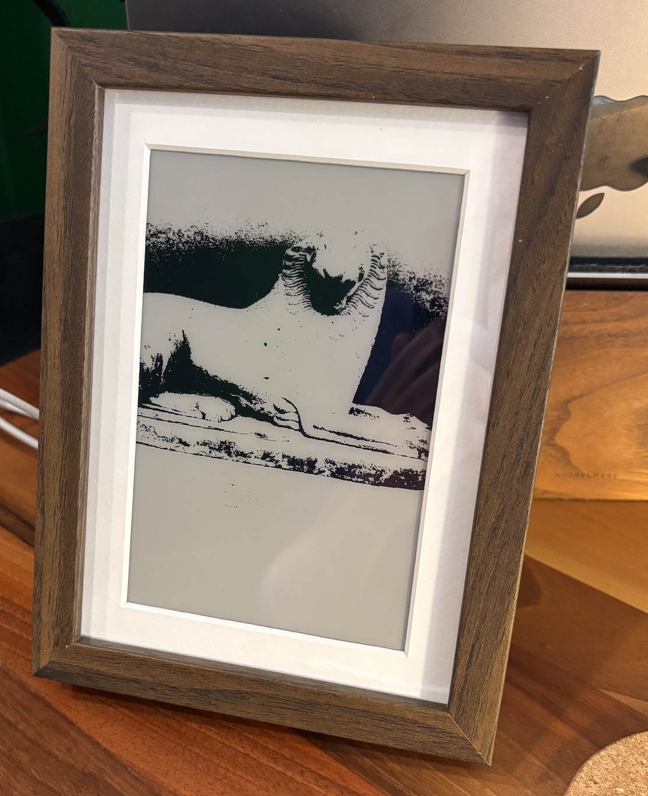
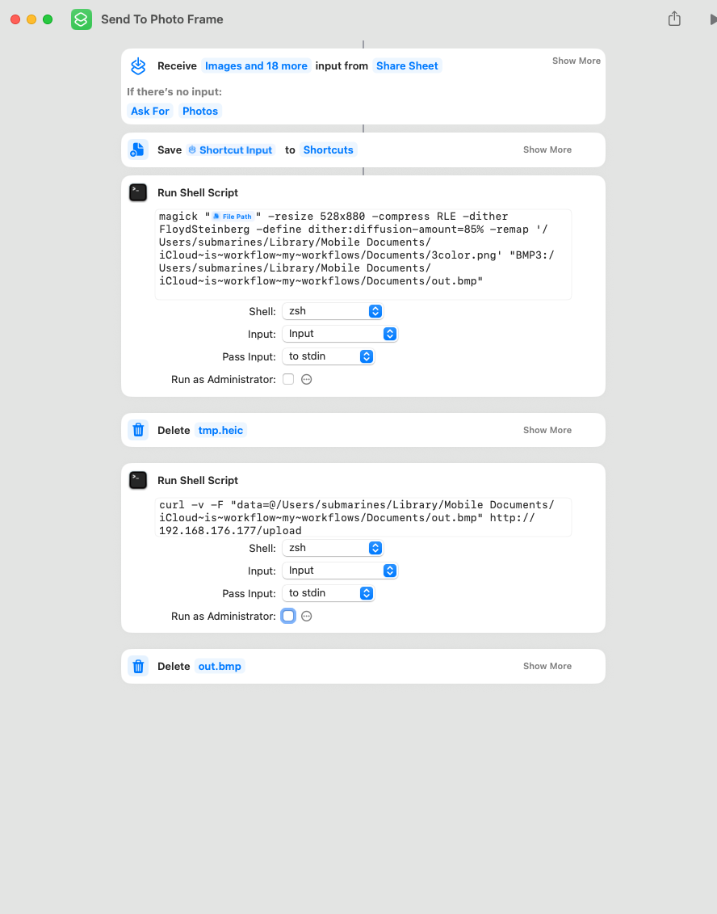

# Photo frame
E-ink display that shows a random picture from apple photos.

To upload an image, either use curl `curl -v -F "data=@/path/to/file.bmp" http://ip.to.server/upload`or use an apple shortcut - see print screen below for inspiration.

## Parts
| Part    | Link |
| -------- | ------- |
| Controller for e-ink displays | https://www.electrokit.com/kontrollerkort-for-e-pappersdisplay-esp32 |
| E-ink display | https://www.aliexpress.com/item/1005004369892606.html |
| Frame | https://www.ikea.com/se/sv/p/roedalm-ram-valnoetsmoenstrad-30548871/#content |

## References
- https://www.waveshare.com/wiki/E-Paper_ESP32_Driver_Board
- https://github.com/jeff-makes/parkpal/tree/main
- https://github.com/javl/image2cpp
- https://github.com/ayushsharma82/ElegantOTA/blob/master/examples/AsyncDemo/AsyncDemo.ino
- https://github.com/Rudranil-Sarkar/Floyd-Steinberg-dithering-algo/tree/master
- https://learn.adafruit.com/preparing-graphics-for-e-ink-displays/command-line
- https://github.com/ESP32Async/ESPAsyncWebServer/blob/main/examples/Upload/Upload.ino
- https://github.com/Rudranil-Sarkar/Floyd-Steinberg-dithering-algo/blob/master/bitmap.cpp